# *Лабораторная работа №6*
**Тема:** Использование шаблонов проектирования

**Цель работы:** Получить опыт применения шаблонов проектирования при написании кода программной системы.

Применим типовые шаблоны для проекта.

## *Шаблоны проектирования GoF*

### Порождающие шаблоны

#### 1. Синглтон

**Назначение:**
Синглтон — это шаблон (паттерн) проектирования, который делает две вещи:
1. Дает гарантию, что у класса будет всего один экземпляр класса.

2. Предоставляет глобальную точку доступа к экземпляру данного класса.

*Для данной системы можно использовать синглтон в качестве обеспечения единого подключения к базе данных. Для этого создадим класс, который будет проверять, что создан только один экземпляр:*

    public sealed class DataBase
    {
        private static volatile DataBase instance;
        private static object syncRoot = new Object();

        private static DBContext connection;

        private DataBase() {
            connection = new MySQLConnection(config.dbconnectionstring);
        }

        public static DataBase Instance
        {
            get 
            {
                if (instance == null) 
                {
                    lock (syncRoot) 
                    {
                    if (instance == null) 
                        instance = new DataBase();
                    }
                }

                return instance;
            }
        }
    }

UML:

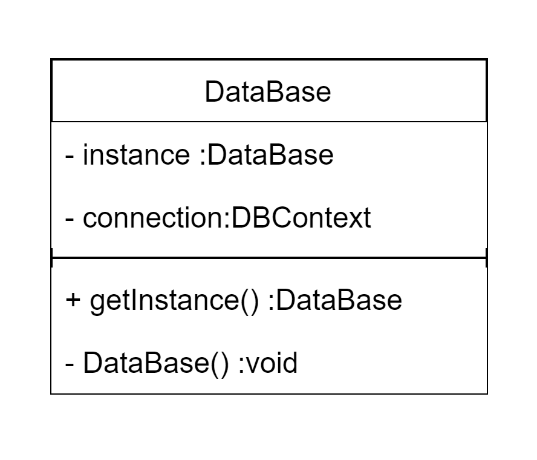

#### 2. Прототип

**Назначение:**
Шаблон проектирования Прототип (Prototype) — это шаблон, который помогает создавать новые объекты путем копирования существующего объекта. Прототип особенно полезен при создании сложных или ресурсоемких объектов.

*Для данной системы можно использовать прототип для создания заданий. Нередко для классов в параллели задается одно и то же задание, поэтому можно создавать прототип задания, который потом будет лишь немного изменяться для отдельного класса:*

    
    interface ICloneable
    {
        ICloneable Clone();
    }

    class Assignment : ICloneable
    {            
        public string Title { get; set; }
        public string Description { get; set; }
        public int ClassId { get; set; }
        public DateTime DueDate { get; set; }
        public int SubjectId { get; set; }

        public Assignment(string title, string description, int classId, DateTime dueDate, int subjectId)
        {
            Title = title;
            Description = description;
            ClassId = classId;
            DueDate = dueDate;
            SubjectId = subjectId;
        }

        public override ICloneable Clone()
        {
            return new Assignment (this.Title, this.Description, this.ClassId, this.DueDate, this.SubjectId);
        }
    }

    // Пример использования
    class Program
    {
        static void Main(string[] args)
        {
            // Создаем прототип задания
            var originalAssignment = new Assignment("Практическое задание №1", "Решить упражнения 1-5", 1, DateTime.Now.AddDays(7), 1);

            // Создаем копию задания
            var clonedAssignment = originalAssignment.Clone();

            // Можем изменить данные клона, не затрагивая оригинальный объект
            clonedAssignment.ClassId = 2;

            //....
        }
    }

UML:

#### 3. Фабричный метод

**Назначение:**
Фабричный метод определяет интерфейс для создания объекта, но оставляет подклассам решение о том, какой класс инстанцировать. Фабричный метод позволяет классу делегировать инстанцирование подклассам.

*Для данной системы можно использовать фабричный метод для создания различных видов пользователей:*

    // Абстрактный класс для пользователя
    abstract class User
    {
        public string login;
        public string email;

        public User(string l, string e) {
            this.login = l;
            this.email = e;
        }
        
        public abstract string GetUserType();
    }

    // Конкретные классы пользователей
    class Teacher : User
    {
        public Teacher(string l, string e) {
            super(l,e);
        }

        public override string GetUserType()
        {
            return "Это учитель.";
        }
    }

    class Staff : User
    {
        public Staff(string l, string e) {
            super(l,e);
        }

        public override string GetUserType()
        {
            return "Это сотрудник.";
        }
    }

    class Parent : User
    {
        public Parent(string l, string e) {
            super(l,e);
        }

        public override string GetUserType()
        {
            return "Это родитель.";
        }
    }

    // Абстрактный класс для фабрики
    abstract class UserFactory
    {
        // Фабричный метод
        public abstract User CreateUser(string l, string e);
    }

    // Конкретные фабрики
    class TeacherFactory : UserFactory
    {
        public override User CreateUser(string l, string e)
        {
            return new Teacher(l,e);
        }
    }

    class StaffFactory : UserFactory
    {
        public override User CreateUser(string l, string e)
        {
            return new Staff(l,e);
        }
    }

    class ParentFactory : UserFactory
    {
        public override User CreateUser(string l, string e)
        {
            return new Parent(l,e);
        }
    }

    // Пример использования
    class Program
    {
        static void Main(string[] args)
        {
            // Создание фабрик
            UserFactory teacherFactory = new TeacherFactory();
            UserFactory staffFactory = new StaffFactory();
            UserFactory parentFactory = new ParentFactory();

            // Создание пользователей через фабричные методы
            User teacher = teacherFactory.CreateUser("lidia123", "lidia123@gmail.com");
            User staff = staffFactory.CreateUser("stepa", "stepa@yandex.ru");
            User parent = parentFactory.CreateUser("msmom", "msmom@mail.ru");

            //...
        }
    }

UML:

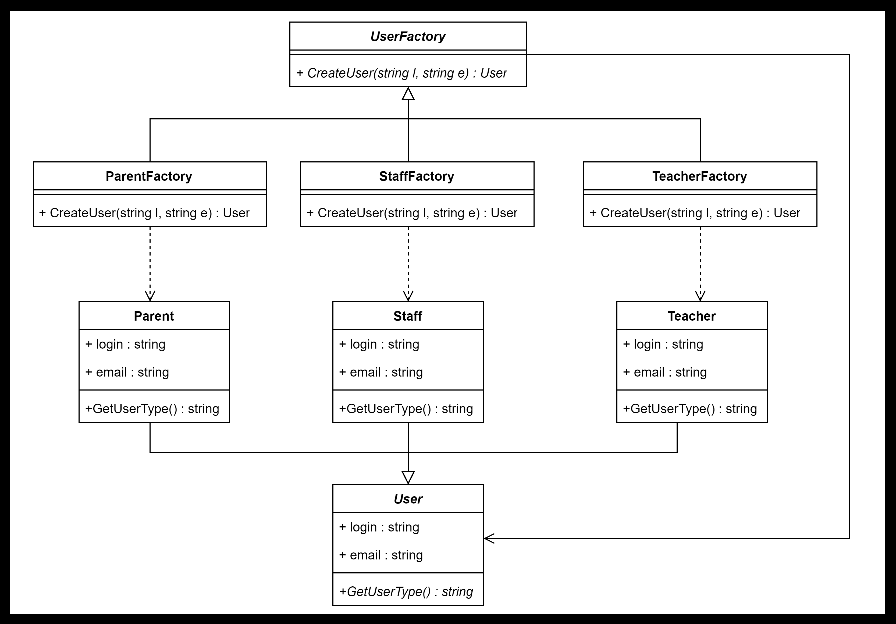

### Структурные шаблоны

#### 1. Декоратор 

**Назначение:**
Динамически добавляет объекту новые обязанности. Является гибкой альтернативой порождению подклассов с целью расширения функциональности.

*Для данной системы можно использовать декоратор для обертки операции выставления оценкок. Для преподавателя достаточно поставить оценку, для родителей требуется уведомление, для администраторов важно видеть результаты через логировние. Чтобы избежать порождения множества подклассов создадим декораторы:*

    abstract class Mark {
        protected float mark;
        public abstract void GiveMark(float m);
    }

    class StudentMark : Mark {
        public override void GiveMark(float m){
            base.mark = m;
        }
    }

    abstract class MarkDecorator : Mark {
        protected Mark mark;

        public void SetMark(Mark mark)
        {
            this.mark = mark;
        }

        public override void GiveMark(float m){
            if (mark != null){
                mark.GiveMark(m);
            }
        }
    }

    class ParentMarkDecorator : MarkDecorator {
        public ParentNotifier notifier;
        public override void GiveMark(float m){
            base.GiveMark(m);
            notifier.Notify("Была поставлена оценка " + m);
        }
    }

    class LoggerMarkDecorator : MarkDecorator {
        public Logger logger;
        public override void GiveMark(float m){
            logget.Log("Вызов выставление оценки " + m);
            base.GiveMark(m);
            logget.Log("Была поставлена оценка " + m);
        }
    }

    // Пример использования
    class Program
    {
        static void Main(string[] args)
        {
            // Создание класса и накладывание декораторов
            mark = new StudentMark();

            decoratedMark = new LoggerMarkDecorator(new ParentMarkDecorator(mark));

            // выполнится логирование и отправка уведомления
            decoratedMark.GiveMark(4);

            //...
        }
    }

UML:

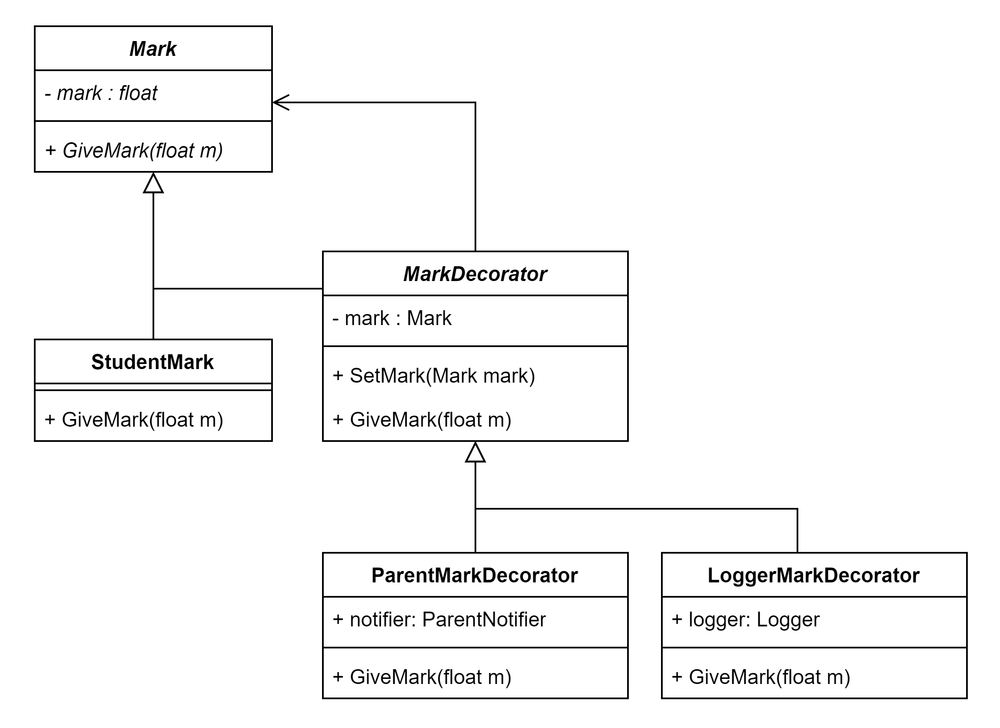

#### 2. Фасад

**Назначение:**
Предоставляет унифицированный интерфейс вместо набора интерфейсов некоторой подсистемы. Фасад определяет интерфейс более высокого уровня, который упрощает использование подсистемы.

*Для данной системы можно использовать фасад для структурирования системы. Например для работы с оценками могут использоваться множество подсистем (репозитории базы данных, сервисы уведомлений)*

    class StudentRepository {
        private DataBase db;

        public void AddMark(string studentId, float mark){
            db.Student.Update("mark", mark);
        }

        public StudentRepository(DataBase db){
            this.db = db;
        }
    }

    class ParentNotifier {
        private EmailService email;

        public void Notify(string msg, Parent p){
            email.Address(p.email).send(msg);
        }

        public ParentNotifier(EmailService email){
            this.email = email;
        }
    }

    public class MarkFacade {
        private StudentRepository _sr;
        private ParentNotifier _pn;

        public MarkFacade(StudentRepository sr, ParentNotifier pn){
            _sr = sr;
            _pn = pm;
        }

        public void AddMark(float m, Student s){
            _sr.AddMark(s.Id, m);
            _pn.Notify("Вашему ребенку поставили оценку " + m, s.Parent);
        }
    }

UML:

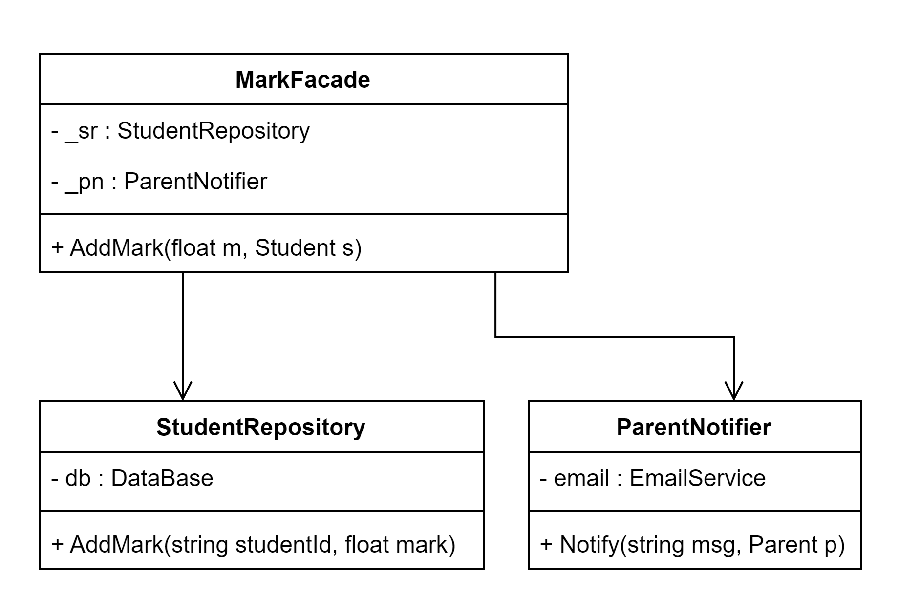

#### 3. Мост

**Назначение:**
Шаблон Мост предполагает, что основной код, необходимый для функционирования объекта, переносится в реализацию. Всё остальное, включая взаимодействие с клиентом, содержится в абстракции. 

*Для данной системы можно использовать мост повсеместно для отделения уровней абстракции. В частности, можно создавать конечные точки (ендпоинты), которые не реализуют функционал системы, а обращается к абстрактной реализации:*
    
    abstract class StudentRepository
    {
        public abstract void GetMissesImp(int id);
    }
    
    abstract class StudentMissingClassEndpoint
    {
        protected StudentRepository StudentRepository;
        public StudentRepository StudentRepository
        {
            set { StudentRepository = value; }
        }
        public StudentMissingClassEndpoint(StudentRepository sp)
        {
            StudentRepository = sp;
        }
        public virtual void GetMisses(int id)
        {
            StudentRepository.GetMissesImp(id);
        }
    }
    
    class RefinedStudentMissingClassEndpoint : StudentMissingClassEndpoint
    {
        public RefinedStudentMissingClassEndpoint(StudentRepository sp)
            : base(sp)
        {}
        public override void GetMisses(int id)
        {
            Console.WriteLine("Получаем пропуски ученика...");
            base.StudentRepository.GetMissesImp(id);
        }
    }

    class ConcreteStudentRepository : StudentRepository
    {
        private DataBase db = DataBase.Instance;
        public override void GetMissesImp(int id)
        {
            var misses = db.Misses.Where("student_id=?", id);
            Console.WriteLine(misses);
        }
    }

    // Пример использования
    class Program
    {
        static void Main(string[] args)
        {            
            StudentMissingClassEndpoint endpoint;
            endpoint = new RefinedStudentMissingClassEndpoint(new ConcreteStudentRepository());
            endpoint.GetMissesImp(3);

            //...
        }
    }
    
UML:

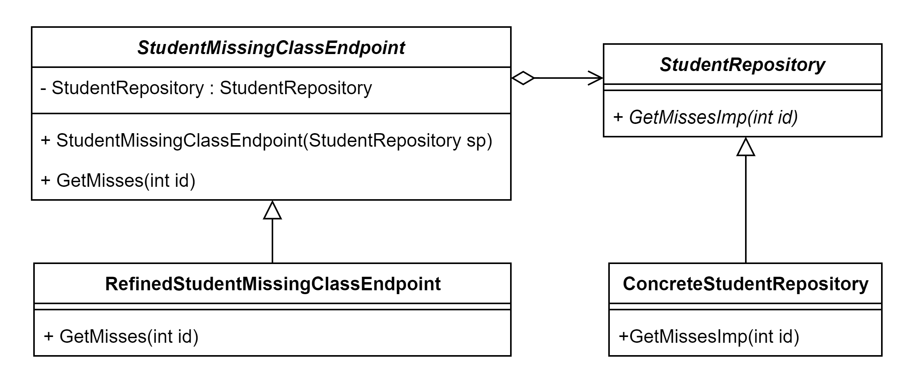

#### 4. Адаптер

**Назначение:**
Преобразует интерфейс одного класса в интерфейс другого, который ожидают клиенты. Адаптер делает возможной совместную работу классов с несовместимыми интерфейсами.

*Для данной системы можно использовать адаптер для совместимости интерфейсов. Предположим, что модули конечных точек и модули работы с базой данных разрабатывались разными людьми. И теперь эндпоинт запрашивает некую функцию ShowClassStudents(Class class), однако модуль работы с базой данных имеет функцию GetStudentsByClassId(int classId). Поэтому для успешной работы системы создадим адаптер:*

    static List<Student> students = new List<Student>();

    public class Students {
        public List<Student> ShowClassStudents(Class class){
            return students.Where(student => student.classId == class.id);
        }
    }

    public class StudentRepository {
        private DataBase db = DataBase.Instance;
        public List<Student> GetStudentsByClassId(int classId) {
            return db.Students.Where("class_id=?", classId);
        }
    }

    public class StudentsAdapter : Students {
        private StudentRepository _sr = new StudentRepository();

        public override List<Student> ShowClassStudents(Class class){
            return _sr. GetStudentsByClassId(class.id); 
        }
    }

    
    // Пример использования
    class Program
    {
        static void Main(string[] args)
        {
            Class class = new Class(1);
            Students students = new StudentsAdapter();
            var result = stuents.ShowClassStudents(class);

            //...
        }
    }

UML:

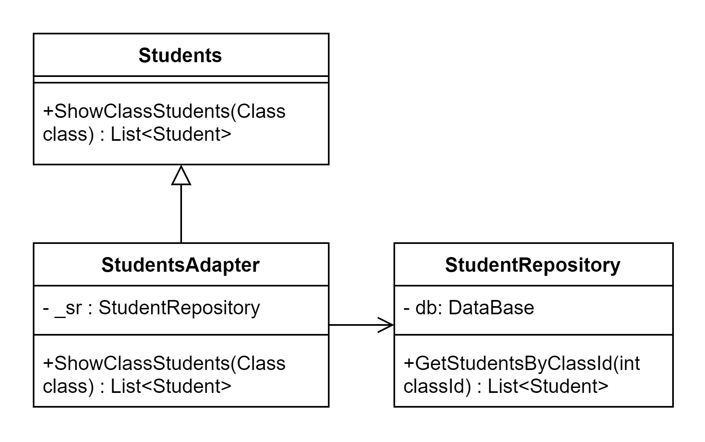

### Поведенческие шаблоны

#### 1. Итератор

**Назначение:**
Представляет доступ ко всем элементам составного объекта, не раскрывая его внутреннего представления.

*Для данной системы можно использовать адаптер для перебора списка учеников в классе. Для различных нужд могут понадобиться различные итераторы (например, перебор по алфавиту, по успеваемости, по индексу, по дате рождения), поэтому будут созданы итераторы для каждого варианта. Пример перебора по индексу:*

    abstract class Iterator
    {
        public abstract object First();
        public abstract object Next();
        public abstract bool IsDone();
        public abstract object CurrentItem();
    }

    class StudentsIdIterator : Iterator
    {
        private ConcreteStudents _students;
        private int _current = 0;
 
        public StudentsIdIterator(ConcreteStudents students)
        {
            this._students = students;
        }
 
        public override object First()
        {
            return _students[0];
        }
 
        public override object Next()
        {
            object ret = null;
            if (_current < _students.Count - 1)
            {
                ret = _students[++_current];
            }
 
            return ret;
        }
 
        public override object CurrentItem()
        {
            return _students[_current];
        }
 
        public override bool IsDone()
        {
            return _current >= _students.Count;
        }
    }

    abstract class Students{
        public abstract Iterator CreateIterator();
    }

    class ConcreteStudents : Students{
        private List<Student> _items = new ArrayList();

        public override Iterator CreateIterator()
        {
            return new StudentsIdIterator(this);
        }

        public int Count
        {
            get { return _items.Count; }
        }
 
        public object this[int index]
        {
            get { return _items[index]; }
            set { _items.Insert(index, value); }
        }
    }

    // Пример использования
    class Program
    {
        static void Main(string[] args)
        {
            ConcreteStudents s = new ConcreteStudents();
            s[0] = new Student("Ваня");
            s[1] = new Student("Таня");
            s[2] = new Student("Витя");
 
            Iterator i = s.CreateIterator();
  
            object item = i.First();
            while (item != null)
            {
                item = i.Next();
                // работа с учеником
            }

            //...
        }
    }

UML:

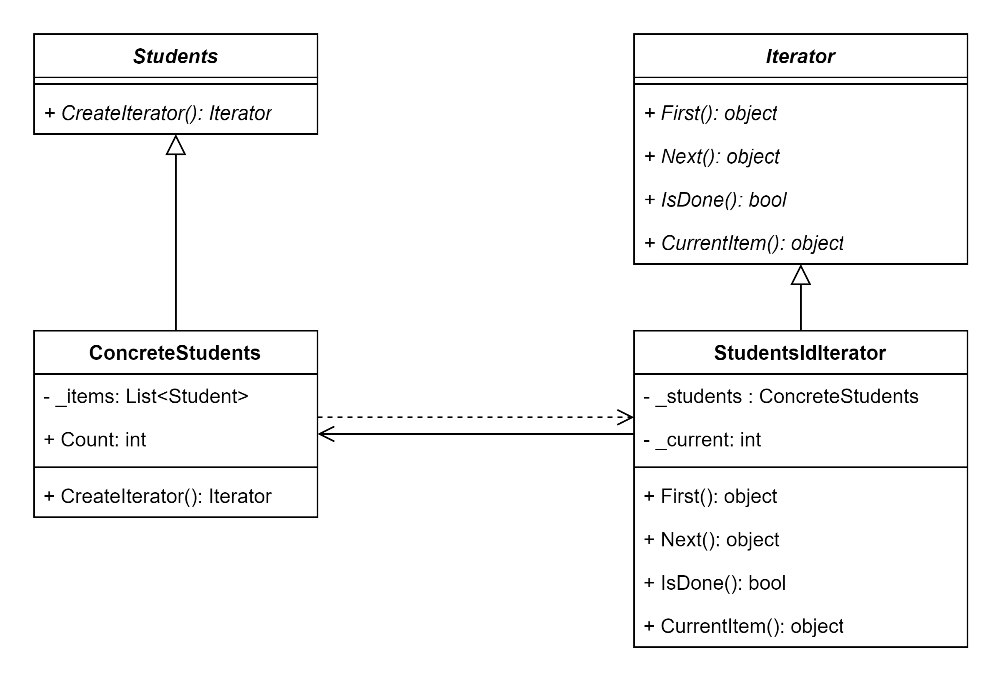

#### 2. Состояние

**Назначение:**
Позволяет объекту варьировать свое поведение в зависимости от внутреннего состояния. Извне создается впечатление, что изменился класс объекта. 

*Для данной системы можно использовать состояние для итзменение поведения сдачи заданий. Например, при поздней сдаче оценка будет умножаться на 0.8:*

    abstract class State
    {
        public abstract void SendTask(Task task);
        public abstract void GiveMark(Task task);
    }

    class TaskOpen : State
    {
        public override void SendTask(Task task)
        {
            if(task.SendTime > task.Deadline) {
                task.State = new TaskSentLate();
            }
            else {
                task.State = new TaskSent();
            }
        }
        public override void GiveMark(Task task)
        {
            Console.WriteLine("Задание еще не сдано!");
        }
    }
    
    class TaskSent : State
    {
        // если задание сдали еще раз
        public override void SendTask(Task task)
        {
            if(task.SendTime > task.Deadline) {
                task.State = new TaskSentLate();
            }
        }
        public override void GiveMark(Task task)
        {
            Console.WriteLine("Задание сдано вовремя с оценкой " + task.mark);
        }
    }

    class TaskSentLate : State
    {
        public override void SendTask(Task task) {}
        public override void GiveMark(Task task)
        {
            task.Mark *= 0.8f;
            Console.WriteLine("Задание сдано с опозданием с оценкой " + task.Mark);
        }
    }

    class Task
    {
        private State _state;

        public DateTime SendTime;
        public DateTime Deadline;
        public float Mark;
    
        public Task(State state, DateTime deadline)
        {
            this.State = state;
            this.Deadline = deadline;
        }
    
        public State State
        {
            get { return _state; }
            set
            {
                _state = value;
            }
        }
    
        public void Send(DateTime sendTime)
        {
            SendTime = sendTime;
            _state.SendTask(this);
        }

        public void GiveMark(float mark){
            this.Mark = mark;
            _state.GiveMark(this);
        }
    }

    // Пример использования
    class Program
    {
        static void Main(string[] args)
        {
            Task t = new Task(new TaskOpen(), DateTime.Now());
 
            // задание сдано вовремя
            t.Send(DateTime.Now() - DateTime.Days(1));
            t.GiveMark(4); // оценка 4

            // задание сдано позднее
            t.Send(DateTime.Now() + DateTime.Days(1));
            t.GiveMark(4); // оценка 3.2

            //...
        }
    }

UML:

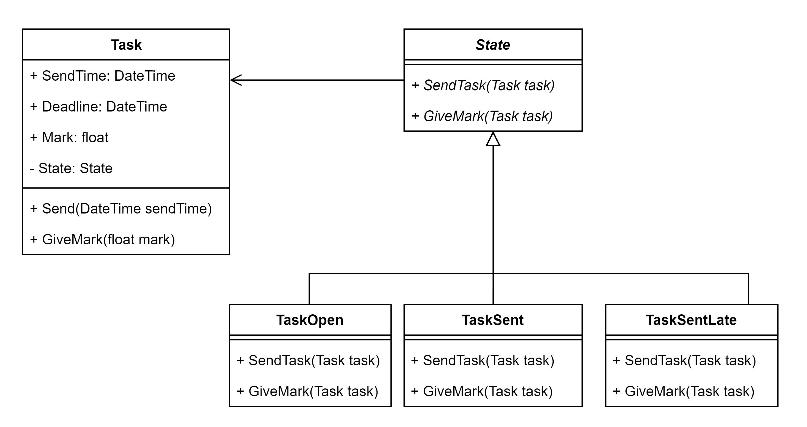

#### 3. Наблюдатель

**Назначение:**
Определяет зависимость типа «один ко многим» между объектами таким образом, что при изменении состояния одного объекта все зависящие от него оповещаются об этом и автоматически обновляются.

*Для данной системы можно использовать наблюдателя для уведомления объектов учеников о появлении нового задания в списке заданий:*

    public abstract class Tasks
    {
        private List<Task> _items = new List<Task>();

        private List<Student> _observers = new List<Student>();
    
        public void Attach(Student observer)
        {
            _observers.Add(observer);
        }
    
        public void Detach(Student observer)
        {
            _observers.Remove(observer);
        }
    
        public abstract void AddTask(Task t);

        private void Notify(List<Task> t)
        {
            foreach (Student s in _observers)
            {
                s.UpdateTasks(t);
            }
        }
    }

    public class ConcreteTasks : Tasks
    {    
        public override void AddTask(Task t){
            base._items.Add(t);
            base.Notify(new List<Task>(){t});
        }
    }

    abstract class Student
    {
        public string name;
        public int classId;

        public List<Task> tasks = new List<Task>();

        public abstract void UpdateTasks(List<Task> tasks);
    }

    class ConcreteStudent : Student
    {
        // таким образом можно подписаться на различные предметы
        private ConcreteTasks _mathTasks;
    
        public ConcreteStudent(ConcreteTasks mathTasks, string name, int classId)
        {
            this._mathTasks = mathTasks;
            base.name = name;
            base.classId = classId;
        }
    
        public override void UpdateTasks(List<Task> tasks)
        {
            base.tasks.AddRange(tasks)
            Console.WriteLine("Задания обновлены");
        }
    
        public ConcreteTasks MathTasks
        {
            get { return _mathTasks; }
            set { _mathTasks = value; }
        }
    } 

    
UML:

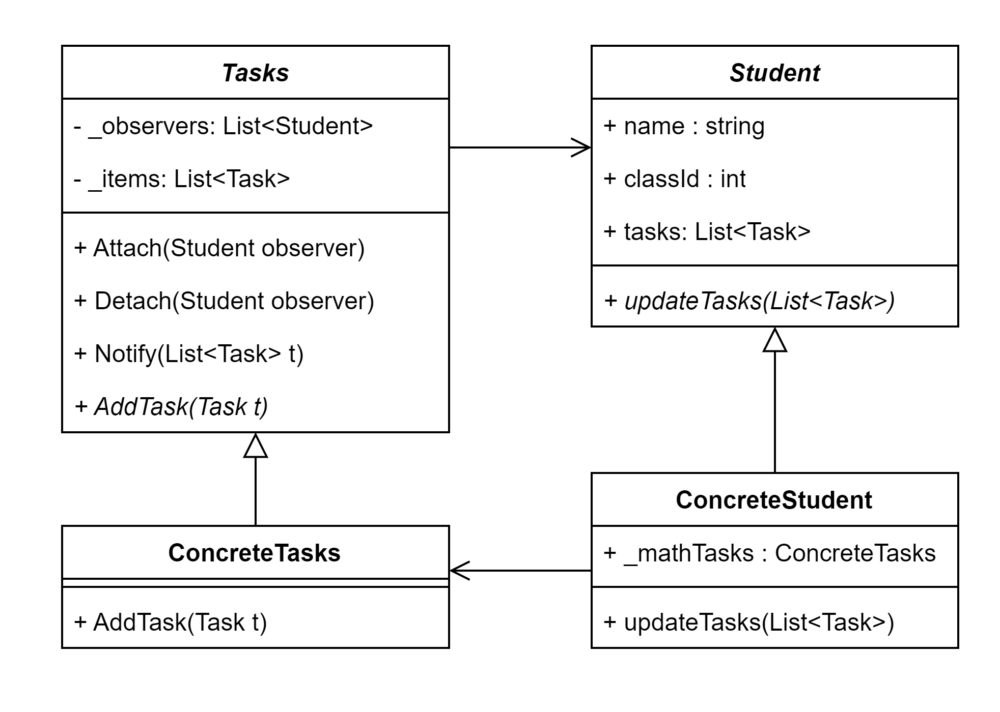

#### 4. Шаблонный метод

**Назначение:**
Шаблонный метод определяет основу алгоритма и позволяет подклассам переопределять некоторые шаги алгоритма, не изменяя его структуры в целом.

*Для данной системы можно использовать шаблонный метод для загрузки личного кабинета пользователя (для каждого пользователя алгоритм будет один и тот же, но состав данных и их представление будет отличаться у учителей, учеников, родителей и пр.):*

    abstract class UserAction
    {
        // Шаблонный метод, определяющий основные шаги действия
        public void Login()
        {
            Authenticate(); 
            LoadUserData(); 
            DisplayUserInfo(); 
        }

        protected abstract void Authenticate();
        protected abstract void LoadUserData();
        protected abstract void DisplayUserInfo();
    }

    class ParentAction : UserAction
    {
        private DataBase db = DataBase.Instance;
        
        private User user;

        private Parent parent;

        protected override void Authenticate()
        {
            Console.WriteLine("Аутентификация родителя через почту");
            // аутентификация
            // ...
            user = auth.Authentificate();
            // ...
        }

        protected override void LoadUserData()
        {
            Console.WriteLine("Получение данных родителя");
            parent = db.Parent.Where("user_id=?", user.Id);
        }

        protected override void DisplayUserInfo()
        {
            Console.WriteLine("Отображение информации о родителе");
            // отображение профиля родителя
        }
    }

    class AdminAction : UserAction
    {
        private DataBase db = DataBase.Instance;
        
        private AdminUser user;

        private Admin admin;

        protected override void Authenticate()
        {
            Console.WriteLine("Аутентификация родителя через номер администратора");
            // аутентификация
            // ...
            user = auth.Authentificate();
            // ...
        }

        protected override void LoadUserData()
        {
            Console.WriteLine("Получение данных администратора");
            admin = db.Admin.Where("user_id=?", user.Id);
        }

        protected override void DisplayUserInfo()
        {
            Console.WriteLine("Отображение информации об администраторе");
            // отображение профиля администратора
        }
    }

    
UML:

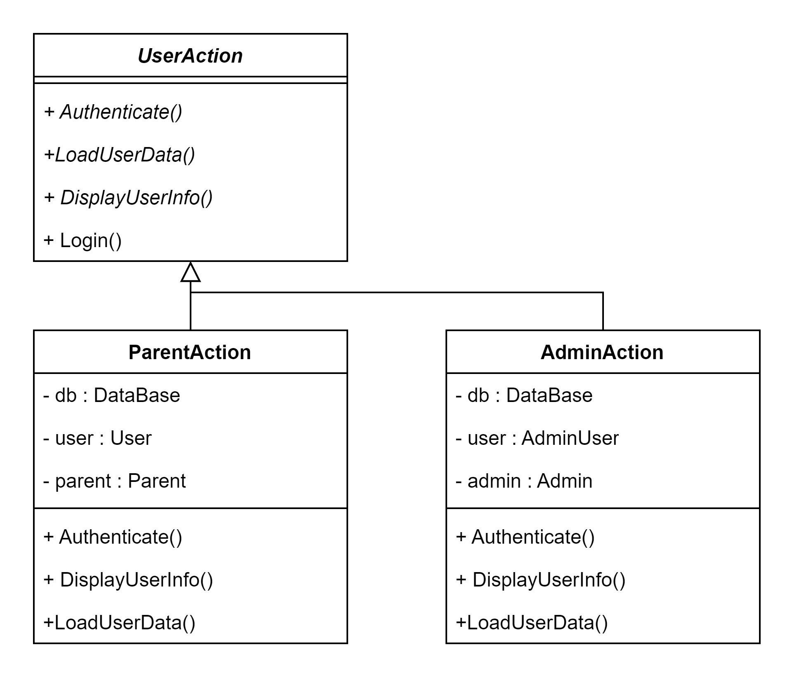

#### 5. Интерпретатор 

**Назначение:**
Паттерн Интерпретатор определяет представление грамматики для заданного языка и интерпретатор предложений этого языка.

*Для данной системы можно использовать интерпретатор для реализации поиска информации по форумам. Пользователь будет вводить ключевые слова, а система искать наиболее подходящие объекты формума:*

    class SearchContext
    {
        public List<ForumPost> Posts;

        public SearchContext(List<ForumPost> posts)
        {
            Posts = posts;
        }
    }

    abstract class Expression
    {
        public abstract List<ForumPost> Interpret(SearchContext context);
    }

    class SearchExpression : Expression
    {
        private string _searchQuery;

        public SearchExpression(string searchQuery)
        {
            _searchQuery = searchQuery;
        }

        public override List<ForumPost> Interpret(SearchContext context)
        {
            Console.WriteLine($"Выполнен поиск по запросу '{_searchQuery}'");

            foreach (var user in context.Posts)
            {
                List<ForumPost> result = new List<ForumPost>();

                // умный поиск форумов по заданному запросу

                return result;
            }
        }
    }

    
    // Пример использования
    class Program
    {
        static void Main(string[] args)
        {
            SearchContext ctx = new SearchContext();

            Expression searchExpr = new SearchExpression("Родительское собрание");

            var result = searchExpr.Interpret(ctx);

            //...
        }
    }

    
UML:

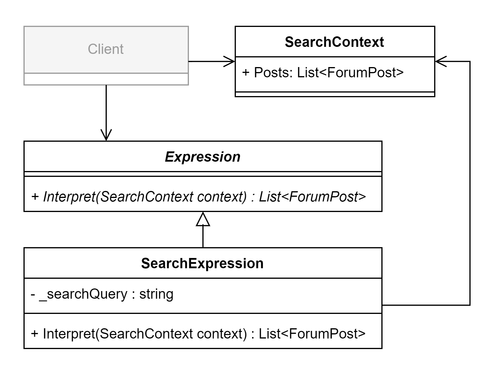
