# *Лабораторная работа №4*
**Тема:** Проектирование REST API

**Цель работы:** Получить опыт проектирования программного интерфейса.

 ## *API методы для сервиса для учителей*

### 1. **POST:** `/class/{id}/homework/create`
 
 Создание домашнего задания для класса 
 
 **Запрос:**
 
*Заголовки:* 	
-    `auth-token` - токен авторизации учителя
	
*Тело:*
	Данные о задании
	
    {
    	"name": "Выполнить задания на стр. 123",
    	"description": "Делаем все задания, кроме 1.4, 1.5",
    	"due_to": "01.03.2024"
    }
 **Ответ:**
 
*HTTP код:* `200`

*Тело:*

Созданный id задания

	{
		"hw_id": 1
	}

**Ошибки:**

*HTTP код:* `400` 

Тело запроса неправильного формата. 

*HTTP код:* `401`

Требуется аутентификация.

*HTTP код:* `404`

ID класса не найден.

###  2. **PUT:** `/class/{id}/homework/{hw_id}`
Редактирование домашнего задания для класса
 
 **Запрос:**
 
*Заголовки:* 	

-    `auth-token` - токен авторизации учителя
	
*Тело:*

Обновленные данные о задании
	
    {
    	"name": "Выполнить задания на стр. 124",
    	"description": "Делаем все задания!",
    	"due_to": "05.03.2024"
    }
 **Ответ:**
 
*HTTP код:* `200`

Задание обновилось

**Ошибки:**

*HTTP код:* `400` 

Тело запроса неправильного формата. 

*HTTP код:* `401`

Требуется аутентификация.

*HTTP код:* `404`

ID класса или домашнего задания не найдены.

###  3. **DELETE:** `/class/{id}/homework/{hw_id}`

Удаление домашнего задания

 **Запрос:**
 
*Заголовки:* 	

-    `auth-token` - токен авторизации учителя
	
 **Ответ:**
 
*HTTP код:* `200`

Задание удалено

**Ошибки:**

*HTTP код:* `401`

Требуется аутентификация.

*HTTP код:* `404`

ID класса или домашнего задания не найдены.

###  4. **GET:** `/class/{id}/homework/{hw_id}`
Просмотр домашнего задания

 **Запрос:**
 
*Заголовки:* 	

-    `auth-token` - токен авторизации учителя
	
 **Ответ:**
 
*HTTP код:* `200`

*Тело:*

Данные о задании с ID `hw_id`
	
    {
    	"name": "Выполнить задания на стр. 124",
    	"description": "Делаем все задания!",
    	"due_to": "05.03.2024"
    }

**Ошибки:**

*HTTP код:* `401`

Требуется аутентификация.

*HTTP код:* `404`

ID класса или домашнего задания не найдены.

###  5. **POST:** `/teacher/login`

Вход в личный кабинет

 **Запрос:**
 
*Тело:*

Логин и пароль учителя
	
    {
      "login": "exampleLogin",
      "password": "password"
    }

 **Ответ:**
 
*HTTP код:* `200`

*Тело:*

Токен авторизации
	
    {
    	"auth-token": "asvhsdvkuqlwevii.23fuoivvjnxkbi3uino.2138c7t98hjwopdv"    	
    }

**Ошибки:**

*HTTP код:* `400` 

Тело запроса неправильного формата. 

*HTTP код:* `403`

Неверные данные пользователя.

###  6. **POST:** `/class/{id}/student/{st_id}/grades/give`

Выставление оценки ученику

 **Запрос:**
 
*Заголовки:* 	

-    `auth-token` - токен авторизации учителя
	
*Тело:*

Описание оценки
	
    {
    	"grade": 4,
    	"for_what": "За контрольную работу №2",
    	"description": "Ошибки в 6 и 10 заданиях",
    	"date": "05.03.2024"
    }
    
 **Ответ:**
 
*HTTP код:* `200`

Оценка выставлена

**Ошибки:**

*HTTP код:* `400` 

Тело запроса неправильного формата. 

*HTTP код:* `401`

Требуется аутентификация.

*HTTP код:* `404`

ID класса или студента не найдены.

###  7. **GET:** `/class/{id}/student/{st_id}`

Просмотр информацию про ученика

 **Запрос:**

*Заголовки:* 	

-    `auth-token` - токен авторизации учителя
	
 **Ответ:**
 
*HTTP код:* `200`

*Тело:*

Данные об ученике

    {
    	"name": "Иван Иванов Иванович",
    	"class": {
		    	"number": 5,
		    	"litera": "Б"
	    	}
    }

**Ошибки:**

*HTTP код:* `401`

Требуется аутентификация.

*HTTP код:* `404`

ID класса или ученика не найдены.

###  8. **GET:** `/class/{id}/grades`

Просмотр табелей успеваемости класса 
 
 **Запрос:**
 
*Заголовки:* 	

-    `auth-token` - токен авторизации учителя
	
 **Ответ:**
 
*HTTP код:* `200`

*Тело:*

Оценки каждого ученика в классе

    {
    	"students": [
	    	{
		    	"Id": 1,
		    	"name": "Игорь Паньков Петрович",
		    	"grades":[
			    	{
				    	"grade": 4,
				    	"for_what": "За контрольную работу №2",
				    	"description": "Ошибки в 6 и 10 заданиях",
				    	"date": "05.03.2024"
				    },
			    	{
				    	"grade": 5,
				    	"for_what": "За контрольную работу №3",
				    	"description": "-",
				    	"date": "10.03.2024"
				    }
		    	]
	    	},
	    	{
		    	"Id": 1,
		    	"name": "Анастасия Демкина Павловна",
		    	"grades":[
			    	{
				    	"grade": 5,
				    	"for_what": "За контрольную работу №2",
				    	"description": "-",
				    	"date": "05.03.2024"
				    }
		    	]
	    	}
    	]
    }

**Ошибки:**

*HTTP код:* `401`

Требуется аутентификация.

*HTTP код:* `404`

ID класса не найден.

 ## *Реализация API*

Для реализации использовался фреймворк Python Flask. Основной код представлен ниже:

  
 Код

	    from flask import render_template, request, url_for, flash, redirect
        from app import app
        from database import mysql
        from authentificator import authentificator
        from flask import Response

        db = mysql.mysql()
        auth = authentificator.authentificator()

        @app.post('/class/<id>/homework/create')
        def create_homework(id):
            token = request.headers.get("auth-token")
            is_authentificated = auth.Authentificate(token)
            if not is_authentificated:
                return Response(status=401)
            if not db.find_class(id):
                return Response(status=404)
            # read request body
            homework = request.json
            hw_id, error = db.create_homework(homework)
            if error:
                return Response(status=400)
            return {
                "hw_id": hw_id
            }, 200

        @app.put('/class/<id>/homework/<hw_id>')
        def update_homework(id, hw_id):
            token = request.headers.get("auth-token")
            is_authentificated = auth.Authentificate(token)
            if not is_authentificated:
                return Response(status=401)
            if not db.find_class(id):
                return Response(status=404)
            if not db.find_homework(hw_id):
                return Response(status=404)
            # read request body
            updated_homework = request.json
            error = db.update_homework(updated_homework)
            if error:
                return Response(status=400)
            return Response(status=200)

        @app.delete('/class/<id>/homework/<hw_id>')
        def delete_homework(id, hw_id):    
            token = request.headers.get("auth-token")
            is_authentificated = auth.Authentificate(token)
            if not is_authentificated:
                return Response(status=401)
            if not db.find_class(id):
                return Response(status=404)
            if not db.find_homework(hw_id):
                return Response(status=404)
            db.delete_homework(hw_id)
            return Response(status=200)

        @app.get('/class/<id>/homework/<hw_id>')
        def get_homework(id, hw_id):
            token = request.headers.get("auth-token")
            is_authentificated = auth.Authentificate(token)
            if not is_authentificated:
                return Response(status=401)
            if not db.find_class(id):
                return Response(status=404)
            hw = db.get_homework(hw_id)
            return hw, 200

        @app.post('/teacher/login')
        def login():
            # read request body
            credentials = request.json
            token, error = auth.login(credentials)
            if error:
                return Response(status=403)
            return {
                "auth-token": token
            }, 200

        @app.post('/class/<id>/student/<st_id>/grades/give')
        def give_grade(id, st_id):
            token = request.headers.get("auth-token")
            is_authentificated = auth.Authentificate(token)
            if not is_authentificated:
                return Response(status=401)
            if not db.find_class(id):
                return Response(status=404)
            if not db.find_student(st_id):
                return Response(status=404)
            # read request body
            grade = request.json
            error = db.give_grade(grade)
            if error:
                return Response(status=400)
            return Response(status=200)

        @app.get('/class/<id>/student/<st_id>')
        def get_student(id, st_id):
            token = request.headers.get("auth-token")
            is_authentificated = auth.Authentificate(token)
            if not is_authentificated:
                return Response(status=401)
            if not db.find_class(id):
                return Response(status=404)
            if not db.find_student(st_id):
                return Response(status=404)
            student = db.get_student(st_id)
            return student, 200

        @app.get('/class/<id>/grades')
        def get_class_grades(id):
            token = request.headers.get("auth-token")
            is_authentificated = auth.Authentificate(token)
            if not is_authentificated:
                return Response(status=401)
            if not db.find_class(id):
                return Response(status=404)
            grades = db.get_class_grades(id)
            return grades, 200

 

 ## *Тестирование API*

### 1. **POST:** `/class/{id}/homework/create`

| **Строка запроса, используемая для тестирования** |   |
|--|--|
| **Передаваемые заголовки** |  | 
| **Передаваемые параметры** |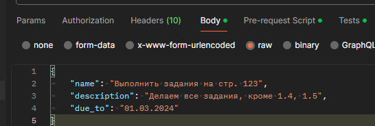    | 
|**Полученный ответ**|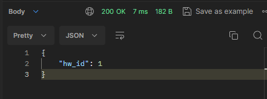  |
| **Код автотестов** |  | 
| **Результаты тестов** |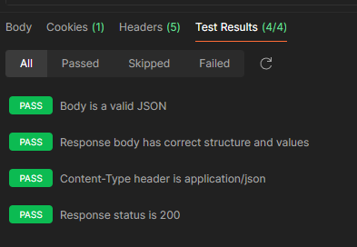  | 

###  2. **PUT:** `/class/{id}/homework/{hw_id}`

| **Строка запроса, используемая для тестирования** |   |
|--|--|
| **Передаваемые заголовки** |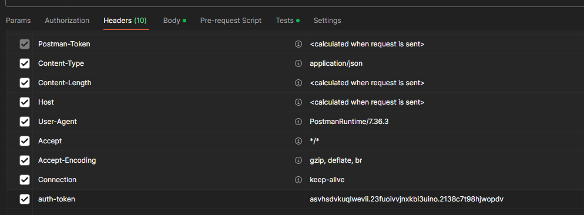  | 
| **Передаваемые параметры** |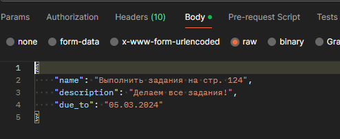    | 
|**Полученный ответ**|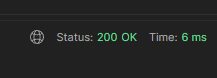  |
| **Код автотестов** |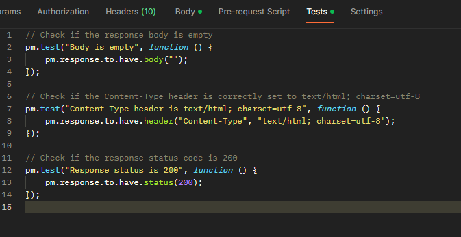  | 
| **Результаты тестов** |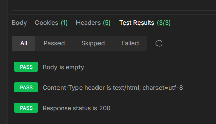  | 

###  3. **DELETE:** `/class/{id}/homework/{hw_id}`

| **Строка запроса, используемая для тестирования** |   |
|--|--|
| **Передаваемые заголовки** |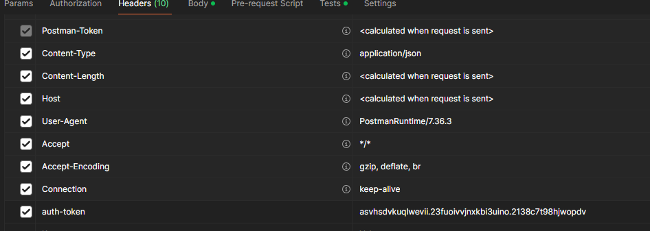  | 
| **Передаваемые параметры** |нет | 
|**Полученный ответ**|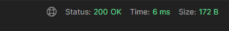  |
| **Код автотестов** |  | 
| **Результаты тестов** |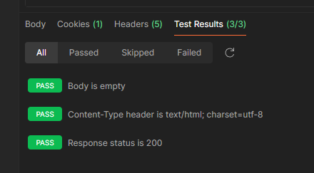  | 

###  4. **GET:** `/class/{id}/homework/{hw_id}`

| **Строка запроса, используемая для тестирования** |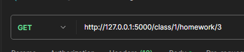   |
|--|--|
| **Передаваемые заголовки** |  | 
| **Передаваемые параметры** |нет| 
|**Полученный ответ**|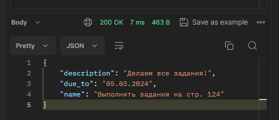  |
| **Код автотестов** |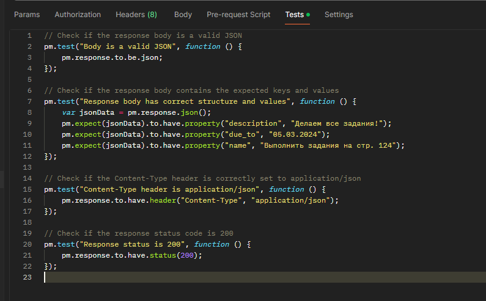  | 
| **Результаты тестов** |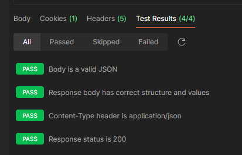  | 

###  5. **POST:** `/teacher/login`

| **Строка запроса, используемая для тестирования** |   |
|--|--|
| **Передаваемые заголовки** |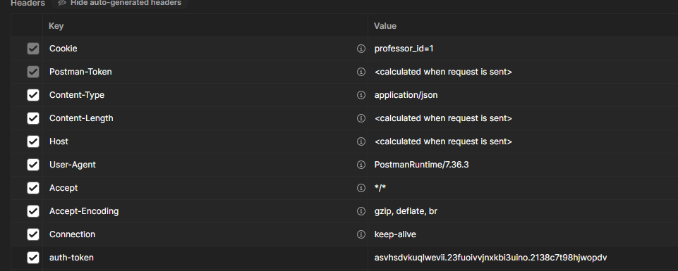  | 
| **Передаваемые параметры** |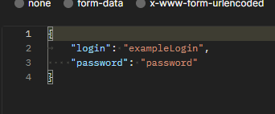    | 
|**Полученный ответ**|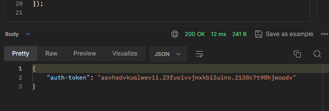  |
| **Код автотестов** |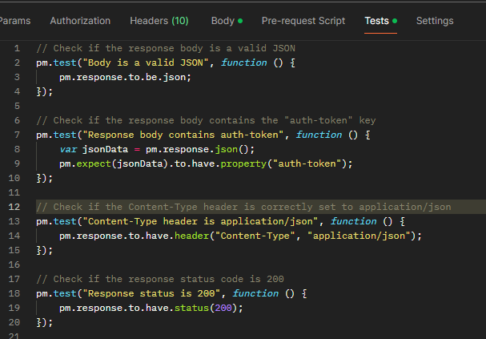  | 
| **Результаты тестов** |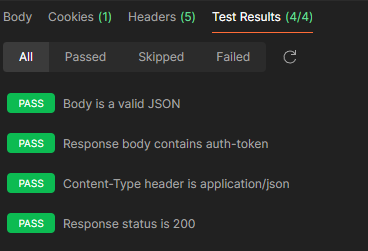  | 

###  6. **POST:** `/class/{id}/student/{st_id}/grades/give`

| **Строка запроса, используемая для тестирования** |   |
|--|--|
| **Передаваемые заголовки** |  | 
| **Передаваемые параметры** |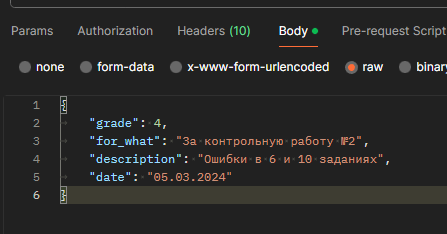    | 
|**Полученный ответ**|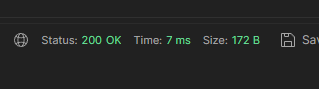  |
| **Код автотестов** |  | 
| **Результаты тестов** |  | 

###  7. **GET:** `/class/{id}/student/{st_id}`

| **Строка запроса, используемая для тестирования** |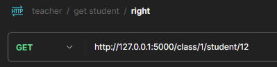   |
|--|--|
| **Передаваемые заголовки** |  | 
| **Передаваемые параметры** |нет    | 
|**Полученный ответ**|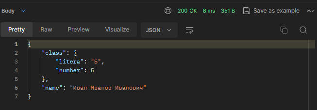  |
| **Код автотестов** |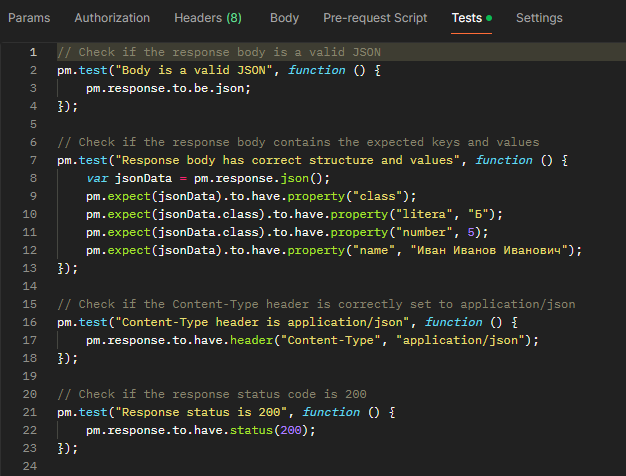  | 
| **Результаты тестов** |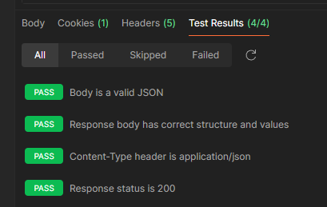  | 

###  8. **GET:** `/class/{id}/grades`

| **Строка запроса, используемая для тестирования** |   |
|--|--|
| **Передаваемые заголовки** |  | 
| **Передаваемые параметры** |нет  | 
|**Полученный ответ**|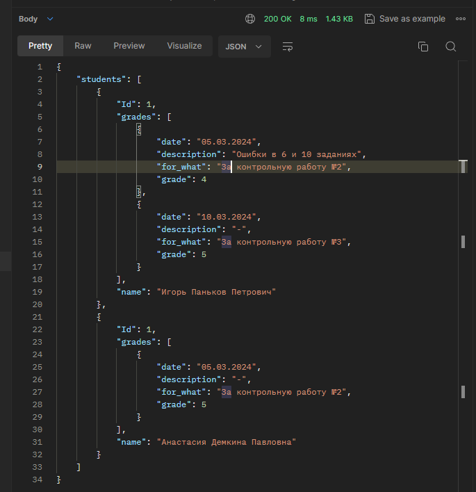  |
| **Код автотестов** |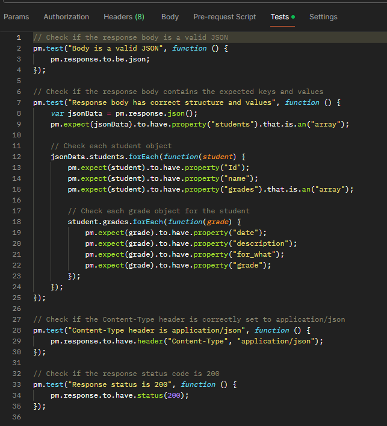  | 
| **Результаты тестов** |  | 

